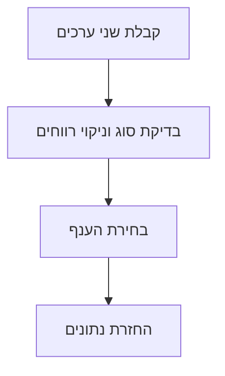

# Python לבוני סוכנים · חלק א׳

## המשימה

### איך הופכים הוראה לתוכנית קטנה?

נבנה תוכנית שמקבלת שני פרטים: שם פעולה וטקסט. לפי שם הפעולה, התוכנית בוחרת אילו הוראות לבצע. לדוגמה, הפעולה `extract` תפצל את המשפט ״שלום עולם״ לרשימת מילים. אנחנו בוחרים את הפעולות בקוד; אין כאן מודל AI או סוכן שמחליט בעצמו.

Python היא שפת תכנות. **קוד** הוא ההוראות שכתבנו בשפה הזאת. **קובץ תוכנית** הוא קובץ טקסט שמכיל את ההוראות, ובתרגיל שלנו שמו יסתיים ב־`.py`. **הרצה** היא הפעלת ההוראות בעזרת תוכנת Python שהותקנה במחשב.

בתרגיל נשתמש בשמות הפעולות `research`, `summarize` ו־`extract`. שתי הפעולות הראשונות יחזירו מידע לתרגול בלבד: לא יתבצע חיפוש אמיתי ולא ייכתב סיכום בעזרת מודל. הפלט יאמר זאת במפורש. המטרה היא ללמוד איך לבחור פעולה, להעביר לה טקסט ולהחזיר נתונים שאפשר לבדוק.

**התוצר שלך:** פונקציה בשם `route`, שמקבלת שני ערכים: שם פעולה וטקסט. הפונקציה תנתב את הטקסט לפעולה שבחרנו. פונקציה היא קבוצת הוראות עם שם, שאפשר להפעיל שוב עם ערכים אחרים. נבנה אותה בשלבים ונבדוק גם קלט שגוי.

## קודם מתרגלים

### 1. מכינים קובץ ומריצים שורה אחת

פתח את תיקיית התרגול מהשיעור הקודם. צור בה קובץ `router.py` באמצעות עורך הקוד שלך. כתוב בו:

```python
print('שלום, בוני סוכנים')
```

הפונקציה `print` מציגה מידע על המסך. הטקסט נמצא בין מירכאות, כדי ש־Python תזהה אותו כטקסט ולא תנסה לבצע אותו כהוראה. שמור את הקובץ. פתח מסוף בתיקייה הזאת — המסוף הוא חלון שבו מקלידים פקודות — והרץ:

```bash
python3 router.py
```

אם במחשב שלך Python מופעלת בעזרת `python` או `py`, השתמש בפקודה הזאת במקום `python3`. התוצאה הצפויה היא שורה אחת: ״שלום, בוני סוכנים״. אם המסוף אינו מזהה את הפקודה, חזור להגדרת Python בשיעור הקודם; שינוי הטקסט בקובץ לא יתקין את Python.

### 2. נותנים שמות לערכים

החלף את תוכן הקובץ בדוגמה הבאה, שמור והרץ שוב:

```python
command = 'extract'
text = 'שלום עולם'
words = text.split()
print(command)
print(words)
```

`command` ו־`text` הם **משתנים**: שמות שקשורים לערכים. `=` משייך את הערך שמימין לשם שמשמאל. `split()` מפצלת את הטקסט לפי תווים לבנים, כגון רווחים, טאבים וירידות שורה, ומחזירה רשימת חלקים. לכן `words` תהיה רשימה של שתי מילים, והפלט שלה יהיה `['שלום', 'עולם']`.

שנה את `text` ל־`'שלום לכל בוני הסוכנים'`. לפני ההרצה, כתוב כמה מילים אתה מצפה לקבל. אחר כך הרץ והשווה. אחרי שינוי הערך בקוד, שמור את הקובץ והרץ אותו מחדש כדי לראות את השינוי.

### 3. בונים את הנתב

מחק את הדוגמה הקודמת מהקובץ והעתק את הקוד הבא. הוא מכיל פונקציה ושלוש שורות שמדגימות איך מפעילים אותה:

```python
# guided-router

def route(command, text):
    if not isinstance(command, str) or not isinstance(text, str):
        raise TypeError('command and text must be strings')

    command = command.strip().lower()
    text = text.strip()
    if not text:
        raise ValueError('text must not be empty')

    if command == 'research':
        result = {'query': text, 'status': 'not_searched'}
    elif command == 'summarize':
        result = {'preview': text[:40], 'status': 'not_summarized'}
    elif command == 'extract':
        result = {'words': text.split(), 'status': 'local_split'}
    else:
        raise ValueError('unknown command')

    return {'action': command, 'result': result}


print(route('extract', 'שלום עולם'))
print(route('research', 'איך בודקים פנייה?'))
print(route('summarize', 'זהו טקסט קצר לתרגול ולא סיכום שנוצר בידי מודל.'))
```

**מילון** הוא מבנה שמקשר בין מפתח לערך. בקריאה הראשונה התוצאה תהיה מילון עם `action` שערכו `extract`, ו־`result` שכולל את המילים ואת המצב `local_split`. המפתח `action` אומר איזו פעולה נבחרה. בקריאה השנייה המצב יהיה `not_searched`, כלומר לא בוצע חיפוש. בשלישית תקבל תחילת טקסט ומצב `not_summarized`, כי חיתוך טקסט אינו סיכום.

### 4. מבינים את הנתב צעד אחר צעד

- `def route(command, text):` מגדירה פונקציה. השמות בסוגריים הם הפרמטרים שלה — שמות לערכים שהיא מקבלת.
- `isinstance(..., str)` בודקת שהערך הוא טקסט. מספר אינו טקסט, גם אם אפשר להציג אותו במסך.
- `strip()` מסירה תווים לבנים, כגון רווחים, טאבים וירידות שורה, בתחילת הטקסט ובסופו; `lower()` ממירה אותיות גדולות לאותיות קטנות בשפות שבהן יש הבדל ביניהן, למשל באנגלית. היא אינה מתרגמת מילים.
- `if`, `elif` ו־`else` קובעות אילו הוראות לבצע לפי תנאי. קבוצת ההוראות שנבחרת נקראת ענף. `==` בודק שוויון; הוא שונה מ־`=`, שמשייך ערך למשתנה.
- `raise` גורמת לתוכנית להודיע על שגיאה כשאי אפשר להמשיך עם הערכים שהתקבלו. בשיעור הבא נלמד גם לטפל בשגיאות מסוימות.
- `return` מחזירה את התוצאה לקוד שהפעיל את הפונקציה. `print` מציגה את התוצאה; אלו שני תפקידים שונים.

### 5. בודקים שלושה מקרים

הוסף בסוף הקובץ את הבדיקות הבאות. `assert` בודקת תנאי, ואם הוא אינו מתקיים היא מעלה שגיאה. אם שלושת התנאים מתקיימים, תופיע ההודעה האחרונה.

```python
assert route('extract', 'שלום עולם')['result']['words'] == ['שלום', 'עולם']
assert route(' RESEARCH ', 'בדיקה')['result']['status'] == 'not_searched'
assert route('summarize', 'א' * 50)['result']['preview'] == 'א' * 40
print('שלוש הבדיקות עברו')
```

אל תשנה את הציפייה בבדיקה רק כדי שלא תופיע שגיאה. אם הבדיקה נכשלת, השווה בין הערך שהתקבל לערך הצפוי וחפש מה גרם להבדל.

## המושגים

### ארבעה מבנים שתראה הרבה

**מחרוזת** היא טקסט, למשל `'שלום עולם'`. אפשר לקרוא חלק ממנה; `text[:40]` מחזירה עד 40 התווים הראשונים. מספר התווים אינו מספר המילים ואינו מגבלת טוקנים של מודל.

**רשימה** שומרת כמה ערכים לפי סדר, למשל `['שלום', 'עולם']`. בתרגיל שלנו סדר המילים ברשימה הוא הסדר שבו הופיעו בטקסט.

**מילון** מקשר מפתח לערך. בדוגמה `{'action': 'extract'}`, המפתח הוא `action` והערך הוא `extract`. אם שמרת את המילון הזה במשתנה בשם result, אפשר לקרוא את הערך בעזרת `result['action']`, אם המפתח קיים.

**ערך בוליאני** הוא `True` או `False`: אמת או שקר. תנאי בודק מה נכון באותו רגע. בדיקה שהפקודה שווה ל־`extract` אינה הבנה של כוונת המשתמש; זו השוואה שהגדרנו בקוד.

### למה הרווחים בתחילת השורה חשובים?

**הזחה** היא הוספת רווחים בתחילת שורה. Python משתמשת בה כדי לזהות אילו שורות שייכות לפונקציה או לענף של תנאי. ההוראות שבתוך הפונקציה מתחילות בארבעה רווחים; הוראות בענף שבתוכה מתחילות בשמונה. אל תערבב רווחים וטאבים. אם שורה יוצאת בטעות מקבוצת ההוראות שאליה היא שייכת, התוכנית יכולה להיכשל או לבצע משהו אחר ממה שהתכוונת.

## איך זה עובד

### עוקבים אחר הקריאה הראשונה

### איך route מעבירה טקסט לפעולה מקומית



**1. קבלת שני ערכים**

הפונקציה מקבלת את שם הפעולה ואת הטקסט. אלו שני ערכים נפרדים; הטקסט אינו בוחר בעצמו את הפעולה.

בדוגמה: command הוא extract, ו־text הוא שלום עולם.

**2. בדיקת סוג וניקוי רווחים**

בודקים ששני הערכים הם טקסט, מסירים רווחים מהקצוות ודוחים טקסט ריק.

בדוגמה: שלום עולם הוא טקסט שאינו ריק, ולכן אפשר להמשיך.

**3. בחירת הענף**

משווים את שם הפעולה לאפשרויות שהגדרנו. רק הענף שמתאים לפקודה מבצע את עבודתו.

בדוגמה: הפקודה extract מפעילה את ענף פיצול המילים.

**4. החזרת נתונים**

מחזירים מילון עם שם הפעולה ותוצאתה. הקוד שקרא לפונקציה יכול לבדוק את הנתונים או להשתמש בהם בהמשך.

בדוגמה: התוצאה כוללת שתי מילים ואת המצב local_split.

שם הפעולה, הקוד שהופעל והתוצאה הם שלושה דברים שאפשר לבדוק בנפרד. אין כאן החלטה של מודל.

## להעמקה

### איך מטפלים בכמה פניות?

**לולאה** חוזרת על הוראות עבור כמה ערכים. בדוגמה הבאה `for` עוברת על רשימת משפטים. בכל פעם המשתנה `message` מקבל משפט אחד, והנתב מופעל עם אותו שם פעולה:

```python
messages = ['שלום עולם', 'פנייה שנייה', 'עוד משפט קצר']
results = []
for message in messages:
    result = route('extract', message)
    results.append(result)
print(results)
```

`append` מוסיפה תוצאה לסוף הרשימה. בסוף יהיו שלוש תוצאות. אם רוצים שפונקציה אחרת תשתמש בהן, צריך להעביר או להחזיר את הרשימה, ולא רק להדפיס אותה.

כשפונקציה מחזירה נתונים, קוד הבדיקה יכול להשתמש בהם. אם היא רק מדפיסה, צריך לקרוא את התוצאה על המסך או לשמור את הפלט שהודפס לצורך בדיקה. שתי הדרכים יכולות להיות שימושיות, אך כדאי לדעת מה התפקיד של כל אחת.

## מנסים, שוברים ומתקנים

### שגיאה היא מידע על מה שלא מתאים

הוסף בסוף הקובץ קריאה אחת: `route('unknown', 'שלום')`. הפעל את התוכנית. היא אמורה להיכשל עם `ValueError` וההודעה `unknown command`, כי שם הפעולה אינו אחד השמות שהגדרנו. הודעת השגיאה המלאה מראה גם היכן התוכנית נעצרה; התחל בקריאת סוג השגיאה וההודעה שבסוף הפלט.

מחק את הקריאה הזאת ונסה `route('extract', '   ')`. התוצאה הצפויה היא `text must not be empty`: אחרי ניקוי הרווחים אין טקסט לעבודה. מחק גם את הקריאה הזאת. לבסוף נסה להעביר מספר במקום טקסט. הפונקציה אמורה להעלות `TypeError`.

אחרי כל ניסיון החזר את הקלט התקין והרץ שוב את שלוש הבדיקות. רשום איזה ערך שגוי ניסית, למה הוא נדחה ואיזו הודעה קיבלת. אין צורך להסתיר את השגיאות; צריך להבין אותן ולתכנן איך מציגים אותן למשתמש.

## אתגר עצמאי

### מוסיפים פעולה ושומרים על הפעולות הקיימות

הוסף פקודה `count_words` שמחזירה את מספר החלקים שהתקבלו מפיצול הטקסט. ספירת החלקים שמופרדים בתווים לבנים, כגון רווחים, טאבים וירידות שורה, אינה ניתוח לשוני מלא. לכן תאר בדיוק מה נספר. שמור על המבנה החיצוני של התוצאה: `action` ו־`result`.

בדוק משפט עם מילה אחת, משפט עם שלוש מילים ורווחים כפולים בין המילים. תכנן מה צריך לקרות כשאין טקסט. לאחר ההרחבה הרץ גם את שלוש הבדיקות המקוריות כדי לוודא שהפעולות הקודמות עדיין עובדות.

## בדיקת הבנה

### הראיות שכדאי להכין

שמור את קובץ הנתב, את שלוש הבדיקות ואת הבדיקות להרחבה. הסבר במילים שלך מה ההבדל בין `return` ל־`print`, למה בודקים קלט, ואיך יודעים איזה ענף נבחר.

בהגשה צרף דוגמת קלט ופלט תקינים, קלט שנדחה והסיבה לדחייה, ואת הפעולה שהוספת. ציין שהפקודות `research` ו־`summarize` הן הדגמות מקומיות ואינן מחוברות לשירותי AI.

## מקורות

- [Python — היכרות עם מספרים, טקסט ורשימות](https://docs.python.org/3/tutorial/introduction.html).
- [Python — תנאים, לולאות ופונקציות](https://docs.python.org/3/tutorial/controlflow.html).

אם מילה בקוד אינה ברורה, מצא את ההסבר שלה במקור וקרא את הדוגמה הקטנה שמופיעה לידו. אין צורך ללמוד את כל Python לפני שתוכל לשנות פונקציה אחת.

## מה כדאי לתעד

כתוב: מה שיניתי בנתב? איזו בדיקה גילתה בעיה? מה גרם לבעיה? מה עשיתי כדי לוודא שהשינוי לא פגע בפעולות הקודמות?

בשיעור הבא נשמור נתונים בקובץ ונקרא אותם בחזרה. כך תוצאה לא תיעלם כשנסיים להפעיל את התוכנית.


## קשרים במפת הידע

- [[01_AGENTS/Agent-Agentic-Workflows|סוכנים ותהליכי עבודה]] — מומחיות בשיעור
- [[01_AGENTS/Agent-Automation-Engineer|אוטומציה וחיבור מערכות]] — מומחיות בשיעור
- [[01_AGENTS/Agent-Business-Discovery|אפיון שירות ופרויקט עסקי]] — מומחיות בשיעור
- [[01_AGENTS/Agent-Code-Reviewer|קוד וניפוי שגיאות]] — מומחיות בשיעור
- [[01_AGENTS/Agent-CRM-Sales|לקוחות, מכירות ושירות]] — מומחיות בשיעור
- [[01_AGENTS/Agent-Curriculum-Auditor|מקורות ועדכוני תוכן]] — מומחיות בשיעור
- [[01_AGENTS/Agent-Curriculum-Pedagogy|הסבר והדרכה]] — מומחיות בשיעור
- [[01_AGENTS/Agent-Database-Architect|מסדי נתונים ומצב]] — מומחיות בשיעור
- [[01_AGENTS/Agent-Hebrew-UX|עברית ברורה וסיכום התשובה]] — מומחיות בשיעור
- [[01_AGENTS/Agent-Knowledge-RAG|ידע, זיכרון ושליפת מקורות]] — מומחיות בשיעור
- [[01_AGENTS/Agent-Model-Data|מודלים, הקשר ונתונים]] — מומחיות בשיעור
- [[01_AGENTS/Agent-Paid-Media-Measurement|פרסום ומדידה]] — מומחיות בשיעור
- [[01_AGENTS/Agent-Production-Reliability|פריסה, ניטור ואמינות]] — מומחיות בשיעור
- [[01_AGENTS/Agent-Progress-Tracker|משוב על העבודה והתקדמות]] — מומחיות בשיעור
- [[01_AGENTS/Agent-Quiz-Designer|תרגול ובדיקות הבנה]] — מומחיות בשיעור
- [[01_AGENTS/Agent-Security-Auditor|אבטחה והרשאות]] — מומחיות בשיעור
- [[01_AGENTS/Agent-Voice-Audio|קול, תמלול ושיחה]] — מומחיות בשיעור
- [[01_AGENTS/Orchestrator-Prime|תיאום צוות ההדרכה]] — מומחיות בשיעור
- [[02_CURRICULUM/2.2.0/exercises/W01D02_PYTHON_FOR_AGENT_BUILDERS_I|התרגול: Python לבוני סוכנים · חלק א׳]] — תרגול מתוך השיעור
- [[02_CURRICULUM/2.2.0/lessons/W01D01_FIRST_AI_PROGRAM|תוכנית ה־AI הראשונה שלך]] — סדר לימוד
- [[02_CURRICULUM/2.2.0/lessons/W01D01_FIRST_AI_PROGRAM|תוכנית ה־AI הראשונה שלך]] — תלות בין שיעורים
- [[02_CURRICULUM/2.2.0/lessons/W01D03_PYTHON_FOR_AGENT_BUILDERS_II|Python לבוני סוכנים · חלק ב׳]] — סדר לימוד
- [[02_CURRICULUM/2.2.0/lessons/W01D03_PYTHON_FOR_AGENT_BUILDERS_II|Python לבוני סוכנים · חלק ב׳]] — תלות בין שיעורים
- [[02_CURRICULUM/2.2.0/modules/CORE|פרק 1: יסודות · פרק חובה]] — שיעור בפרק
- [[02_CURRICULUM/2.2.0/skills/GIT|Git]] — מיומנות בשיעור
- [[02_CURRICULUM/2.2.0/skills/HTTP_APIS|HTTP/APIs]] — מיומנות בשיעור
- [[02_CURRICULUM/2.2.0/skills/PYTHON|Python]] — מיומנות בשיעור
- [[02_CURRICULUM/2.2.0/sources/PYTHON_TUTORIAL|Python tutorial]] — מקור לשיעור
- [[02_CURRICULUM/quiz-banks/1.0.0-draft/QUIZ_W01D02_PYTHON_FOR_AGENT_BUILDERS_I|בדיקת הבנה: הנתב החזיר status מסוג not_searched עבור הפעולה research. מה אפשר להסיק?]] — בדיקת הבנה
- [[02_CURRICULUM/system-quizzes/1.0.0/QUIZ_EVIDENCE_NEXT_STEP|לפני שמגישים · שאלה קצרה לתרגול]] — תרגול לפני הגשה
- [[03_PRACTICAL_PROOFS/2.2.0/rubrics/ASSESS_W01D02_PYTHON_FOR_AGENT_BUILDERS_I|הוכחה מעשית · Python לבוני סוכנים · חלק א׳]] — הוכחה מעשית
- [[04_AUTOMATIONS_AND_APIS/assets/PYTHON_I_LAB|תרגיל Python — חלק א׳]] — קובץ עזר לשיעור
