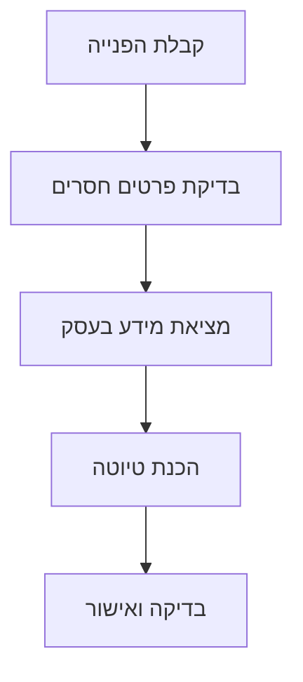

# מפת עולם ה־AI

[[קורס/2.2.0/פרקים/CORE|לפרק פרק 1: יסודות · פרק חובה]] · הבא: [[קורס/2.2.0/שיעורים/W01D01_FIRST_AI_PROGRAM|תוכנית ה־AI הראשונה שלך]]

## המשימה

### מתחילים מבעיה שאפשר להבין

לקוח כותב לעסק: ״אני צריך התקנה ביום ראשון. כמה זה יעלה?״. בעל העסק רוצה לטפל בפנייה מהר, אבל חסרים פרטים: איזה מוצר מתקינים? באיזו כתובת? לאיזה יום ראשון הלקוח מתכוון?

המטרה שלנו היא לתכנן דרך לטיפול בפנייה. אין צורך לדעת לתכנת בשיעור הזה, להתקין תוכנה או לקנות מנוי. אפשר להשתמש בדף, במסמך או בגיליון. אין צורך לכתוב SQL או להתחבר למודל AI כדי לבצע את התרגיל.

AI הוא קיצור של בינה מלאכותית. זהו תחום שכולל שיטות ומערכות שונות. בקורס נשתמש בעיקר במודלים: רכיבים חישוביים שלמדו דפוסים מתוך נתונים, כגון טקסטים או מספרים, בתהליך שנקרא אימון. מודל שפה עובד עם טקסט ויכול לעזור, למשל, להכין סיכום או טיוטת תשובה.

בסוף השיעור תדע להציע דרך פתרון לצורך עסקי: להשתמש בכלל קבוע, לחפש מידע קיים או להיעזר במודל. תדע גם להסביר איך לבדוק את התוצאה.

**התוצר שלך:** טבלה של שמונה צרכים עסקיים. בכל שורה יהיו צורך, קלט, פתרון אפשרי, תוצאה רצויה ודרך לבדוק אותה. קלט הוא המידע שנכנס לתהליך; פלט הוא מה שהתהליך מחזיר. למשל, הודעת הלקוח היא קלט, ובקשה להשלמת כתובת יכולה להיות הפלט.

נתחיל בשתי שורות פתורות, ואז תוסיף שורות משלך. הבחירות בדוגמאות הן הצעות לתרגול, ולא הבטחה שהן יתאימו לכל עסק.

## קודם מתרגלים

### 1. לומדים משתי שורות פתורות

צור מסמך בשם ״מפת צרכים בעסק״. העתק אליו את כותרות הטבלה ושתי השורות הפתורות שלהלן. אחר כך תוסיף שש שורות משלך.

לפני שמסתכלים בטבלה, נכיר שני מונחים. **מזהה מוצר** הוא קוד שמבדיל מוצר אחד מאחרים, למשל P1. **רשומה** היא המידע ששמור על פריט אחד, למשל המזהה והמחיר שלו ברשימת המחירים.

**נתונים מומצאים לצורך הדוגמה בלבד:** ברשימת המחירים שלנו, המחיר של המוצר P1 הוא 200 ש״ח. הודעת הלקוח היא ״אני צריך התקנה ביום ראשון״. אין כאן עסק אמיתי או מחיר שנבדק מול עסק.

| הצורך | מה נכנס? | דרך פתרון אפשרית | מה רוצים לקבל? | איך בודקים? |
| --- | --- | --- | --- | --- |
| מחיר של מוצר מסוים | מזהה המוצר P1 | חיפוש ברשימת המחירים של העסק | 200 ש״ח, לפי רשימת המחירים שבדוגמה | בודקים שהמוצר שנבחר הוא P1 ושהמחיר תואם לרשימה |
| סיכום פנייה | ״אני צריך התקנה ביום ראשון״ | מודל שפה שמכין טיוטה | ״הלקוח מבקש התקנה ביום ראשון״ | משווים להודעה המקורית ובודקים שלא נוספו פרטים |

בדוגמה הראשונה המחיר כבר קיים ברשימה. צריך למצוא אותו, לא להמציא מחיר חדש. אם קיבלנו 200 ש״ח אבל בחרנו מוצר אחר, הבדיקה עדיין לא עברה.

בדוגמה השנייה רוצים לנסח את תוכן הפנייה כך שעובד בעסק יוכל להבין מה הלקוח מבקש. מודל שפה יכול לעזור, אבל אדם צריך להשוות את הטיוטה לפנייה. ההודעה הזאת קצרה ואפשר לסכם אותה גם בלי מודל; לא כל משימת ניסוח דורשת AI. הסיכום שבטבלה נכתב כאן כדוגמה פתורה; הוא אינו תשובה שהתקבלה ממודל. אין בו כתובת, שעה או אישור התקנה, כי הלקוח לא מסר אותם.

### 2. דוגמה פתורה: מה ידוע ומה חסר?

נבחן יחד את המשפט ״אני צריך התקנה ביום ראשון״. כך אפשר לחלק את המידע:

- **מה ידוע:** הלקוח מבקש התקנה, והוא הזכיר יום ראשון.
- **מה חסר:** מוצר, כתובת ותאריך מדויק. ייתכן שחסרים גם פרטים אחרים לפי הנהלים של העסק.

**תשובה אפשרית בדוגמה:** ״איזה מוצר תרצה להתקין, באיזו כתובת ובאיזה תאריך?״. זו בקשה להשלמת מידע, ולא אישור הזמנה או הצעת מחיר. עדיין לא ידוע איזה מוצר הלקוח רוצה, ולכן גם מחיר P1 שבטבלה אינו מספיק כדי לתת לו מחיר.

**עכשיו תורך:** העתק את שתי הרשימות למסמך שלך. נסח בעצמך בקשה קצרה להשלמת המידע. השווה לדוגמה: האם ביקשת מוצר, כתובת ותאריך מדויק? האם הוספת הבטחה שלא בדקת?

### 3. תרגול עצמאי: משלימים שש שורות נוספות

הוסף לטבלה שורה לכל אחד מששת הצרכים הבאים. בכל שורה מלא את כל חמש העמודות. הדוגמאות בכל סעיף יעזרו להבין את הצורך; הן אינן פתרונות מוכנים:

- **חיפוש נוהל:** מציאת הוראות של העסק, למשל באילו תנאים אפשר להחזיר מוצר.
- **חילוץ פרטים מפנייה:** העברת מידע מהטקסט לשדות נפרדים, למשל שם, תאריך ומוצר.
- **תמונה לפרסום:** הכנת תמונה שמתאימה למוצר ולמסר של העסק.
- **תמלול שיחה:** הפיכת הדיבור שהוקלט לטקסט.
- **תחזית עומס:** הערכה של כמות העבודה שעשויה להיות, למשל מספר הפניות מחר. זו הערכה, ולא ידיעה ודאית.
- **אישור הוצאה:** בדיקה אם מותר להוציא סכום מסוים ומי צריך לאשר אותו.

לכל צורך שאל: האם התשובה כבר שמורה במקום מסוים? האם יש כלל עסקי שאפשר לבדוק? האם צריך ליצור טיוטה? מי בודק את התוצאה לפני שמשתמשים בה? אפשר לכתוב ״עדיין חסר מידע לבחירה״ ולהסביר מה צריך לברר.

### 4. בודקים את הטבלה

בחר שתי שורות ותן לאדם אחר לקרוא אותן. בקש ממנו להסביר מה נכנס ומה אמור לצאת. אם הוא צריך לנחש, הוסף דוגמה. גם אם אין לידך אדם נוסף, נסה לקרוא את הטבלה כאילו אינך מכיר את התהליך.

## המושגים

### מרחיבים את המושגים שהשתמשנו בהם

בינה מלאכותית, או AI, כוללת שיטות ומערכות שונות. בקורס הזה נלמד בעיקר איך משתמשים במודלים קיימים בתוך תהליך עסקי ואיך בודקים את התוצאה. אין צורך לבחור כלי לכל צורך כבר עכשיו.

**נתונים** הם המידע שבו משתמשים, למשל טקסטים, תמונות או מספרים. **מודל** הוא רכיב חישובי שאומן על נתונים. **אימון** הוא תהליך שבו מתאימים ערכים פנימיים במודל. **הפעלה** היא שימוש במודל שכבר קיים כדי לקבל תוצאה. כששולחים בקשה לשירות שמפעיל מודל, עצם הבקשה אינה אימון מחדש שלו.

**מודל שפה** עובד עם טקסט ויכול ליצור הסבר, טיוטה או סיכום. הוא עלול להוסיף פרט שגוי גם כשהניסוח משכנע. לכן, ״התשובה נשמעת טוב״ ו״בדקנו שהיא נכונה״ הם שני דברים שונים.

**מודל גנרטיבי**, כלומר מודל יוצר, מייצר תוכן כגון טקסט, תמונה או קול. **מודל חיזוי** מעריך תוצאה מתוך נתונים, למשל עומס צפוי. בחירה במודל חיזוי דורשת נתונים ובדיקה שמתאימים למשימה; אין בסיס להבטיח תחזית טובה רק מפני שהכלי נקרא AI.

### שלוש דרכי עבודה שכדאי להכיר עכשיו

1. **כלל קבוע:** ״הוצאה מעל סכום מסוים דורשת אישור״. העסק קובע את הסכום. הקוד — ההוראות שהתוכנה מבצעת — יכול לבדוק אותו. אין צורך במודל כדי להשוות שני מספרים.
2. **חיפוש מידע:** מחיר או נוהל שמורים במקור. מוצאים את הרשומה המתאימה ומשתמשים בה. בשיעורים הבאים נלמד גם על מסד נתונים — מקום מסודר לשמירת מידע — ועל SQL, שפה לקריאת מידע ולעדכונו.
3. **יצירת טיוטה בעזרת מודל:** מכינים סיכום או ניסוח. מגדירים מה מותר לכלול ומשווים למקור לפני שימוש.

תהליך יכול לשלב את שלוש הדרכים. למשל, מודל מציע איזה מוצר מוזכר בהודעה, הקוד מחפש את מחירו בקטלוג, כלומר ברשימת המוצרים והמחירים, ואדם מאשר את ההצעה. **אוטומציה** היא ביצוע של שלבים בעזרת תוכנה לפי תהליך שהגדרנו. היא יכולה לכלול AI, אך יכולה גם לעבוד בלי מודל בכלל.

## איך זה עובד

### עוקבים אחר פנייה אחת

התרשים מציג תהליך לדוגמה בעסק התקנות. בכל שלב בדוק איזה מידע יש לנו ומה עדיין אסור להסיק ממנו.

### מהודעת לקוח לטיוטה שאפשר לבדוק

**1. קבלת הפנייה**

שומרים את הדברים שהלקוח מסר. עדיין לא משנים הזמנה ולא מבטיחים מחיר.

בדוגמה: אני צריך התקנה ביום ראשון.

**2. בדיקת פרטים חסרים**

בודקים מה צריך לדעת כדי לטפל בבקשה. אם חסר פרט חיוני, שואלים את הלקוח וממתינים להשלמה.

בדוגמה: לא ידועים המוצר, הכתובת והתאריך המדויק.

**3. מציאת מידע בעסק**

אחרי שהתקבלו הפרטים, קוראים את המחיר או הנוהל מהמקור המתאים. מודל אינו מחליף את רשימת המחירים.

בדוגמה: מחפשים את מחיר המוצר לפי מזהה המוצר שהתקבל.

**4. הכנת טיוטה**

מנסחים תשובה על בסיס המידע שנמצא. מודל יכול לעזור בניסוח; התוצאה עדיין צריכה בדיקה.

בדוגמה: טיוטה שמציינת את המוצר והמחיר שנמצאו, בלי להמציא זמינות.

**5. בדיקה ואישור**

משווים את הטיוטה למידע המקורי ולמקורות העסק. רק אחרי אישור מתאים מבצעים פעולה שמשנה את המצב.

בדוגמה: בודקים שהמוצר והמחיר תואמים. אין אישור למועד התקנה שלא נבדק.

בחירת כלי מגיעה אחרי שמבינים מה צריך להשיג, איזה מידע זמין ואיך בודקים את התוצאה.

אם העסק פועל אחרת, גם התהליך יכול להשתנות. התרשים עוזר לנו לחשוב; הוא אינו מחייב שכל עסק יפעל באותם חמישה שלבים.

## להעמקה

### מה ההבדל בין תשובה לפעולה?

כתיבה של ״ההזמנה אושרה״ היא טקסט. שמירת הזמנה מאושרת במערכת היא פעולה. כדי לבצע פעולה צריך קוד, כלומר הוראות שהתוכנה מבצעת, וגם גישה למערכת והרשאה מתאימה. **הרשאה** מגדירה מה למשתמש או לתוכנה מותר לקרוא או לשנות. המשפט לבדו אינו מוכיח שההזמנה נשמרה.

דמיין שלושה תוצרים מהודעת הלקוח: סיכום של ההודעה, טיוטת תשובה ועדכון הזמנה. סיכום וטיוטה אפשר לבדוק בלי לשנות את ההזמנה. עדכון הזמנה משנה מידע עסקי, ולכן צריך תנאים ואישור לפני השינוי, וגם בדיקה של המצב אחריו.

### מתי משתמשים בסוכן?

**כלי** הוא פעולה מוגדרת שהתוכנה יכולה לבצע, למשל חיפוש מחיר ברשימה. בקורס נשתמש במילה **סוכן** למערכת שבה מודל יכול לבחור את הצעד הבא ואת הכלי שבו ישתמש. הקוד מגביל אילו פעולות מותר לבצע.

אם כל השלבים ידועים מראש, תהליך קבוע עשוי להיות בחירה פשוטה יותר. אלו מונחים שנעשה בהם שימוש בהמשך; אין צורך לבנות סוכן בשיעור הזה.

למשל, חישוב מחיר מתוך קטלוג אינו נעשה טוב יותר רק כי מכנים את הפתרון ״סוכן״. קודם בדוק אם חיפוש וכלל פשוטים מספיקים. אם הם אינם מספיקים, נסח מה חסר ובחן האם מודל עוזר לפתור את הבעיה הזאת.

## מנסים, שוברים ומתקנים

### מוצאים פרט שהומצא

קרא את הטיוטה הבאה, שנכתבה כאן לצורך התרגיל:

> קבענו לך התקנה ביום ראשון בשעה 10:00, בעלות של 350 ש״ח.

זו **דוגמה מומצאת**, ולא תשובה שהופקה משירות AI. חזור להודעה המקורית: ״אני צריך התקנה ביום ראשון״. סמן כל פרט בטיוטה שאין לו בסיס בהודעה או במקור עסקי שנבדק. השעה, המחיר והאישור לא נמסרו ולא נבדקו.

הכן טיוטה מתוקנת שמבקשת השלמה במקום להמציא פרטים. כתוב ליד כל פרט מדוע הוצאת אותו. לאחר מכן בחר שורה אחת בטבלה שלך והוסף בדיקה שיכולה לזהות טעות דומה. לדוגמה: ״כל מחיר בתשובה חייב להתאים לרשומת המוצר שנבחר״.

## אתגר עצמאי

### מיישמים בעסק אחר

חנות רוצה לדעת כמה יחידות נשארו במלאי, וגם רוצה סיכום של שיחה עם לקוח. הצע דרך פתרון לכל צורך. הסבר איזה מידע צריך, מאיזה מקור תגיע התוצאה ואיך בודקים אותה. אין חובה להשתמש באותה דרך בשתי המשימות.

הוסף מקרה שבו המידע חסר: אין מזהה מוצר, או שחלק מהשיחה לא הוקלט. מה הפתרון שלך אמור לומר או לעשות? כתוב במפורש היכן הוא צריך לעצור ולבקש מידע.

## בדיקת הבנה

### מה מגישים לבדיקה?

המחוון הוא רשימת התנאים שלפיהם מעריכים את העבודה. הכן שלושה חלקים:

- **הטבלה:** שמונה צרכים, עם דוגמה לקלט, דרך פתרון ובדיקה לכל צורך.
- **תיקון הטיוטה:** פירוט הפרטים שלא היה להם בסיס והנוסח שהכנת במקום.
- **האתגר:** פתרון למלאי ולסיכום שיחה, עם הסבר לבחירות ולמידע החסר.

לפני ההגשה, נסה להסביר בקול למה המחיר מגיע מהקטלוג ולמה סיכום צריך השוואה למקור. אם אתה עדיין מסתפק ב״ה־AI יטפל בזה״, חזור לדוגמה ופרק אותה לשלבים. באתר, סימון שהתרגיל נבנה והגשת העבודה לבדיקה הם שני שלבים נפרדים. מעבר בין שקופיות מאפשר לקרוא וללמוד; הוא אינו אישור מקצועי.

## מקורות

- [Google — מבוא למודלי שפה](https://developers.google.com/machine-learning/crash-course/llm): הרחבה על מודלי שפה והקשר. אין צורך לקרוא את כל הקורס של Google עכשיו.
- [Anthropic — תהליכים קבועים וסוכנים](https://www.anthropic.com/engineering/building-effective-agents): קרא את ההבחנה בין תהליך עבודה קבוע (workflow) לסוכן ואת ההסבר על בחירת פתרון פשוט.

הדוגמאות העסקיות בשיעור נועדו לתרגול. כשמתכננים שירות לעסק אמיתי, צריך לברר את הנתונים, הנהלים, ההרשאות ודרך הבדיקה שלו.

## מה כדאי לתעד

כתוב שלוש שורות: צורך אחד שהיית מנסה לפתור בעזרת מודל, צורך אחד שהיית פותר בלי מודל, והבדיקה החשובה ביותר בתהליך שבחרת. הסבר כל בחירה במשפט.

שמור את הטבלה בתיקיית הלמידה שלך. אם אתה מוסיף מידע להערות באתר, השתמש בנתוני התרגיל ובשמות בדויים. בשיעור הבא נתחיל להכיר את סביבת העבודה ואת הדרך להפעיל תוכנית קטנה.

[[קורס/2.2.0/פרקים/CORE|לפרק פרק 1: יסודות · פרק חובה]] · הבא: [[קורס/2.2.0/שיעורים/W01D01_FIRST_AI_PROGRAM|תוכנית ה־AI הראשונה שלך]]
